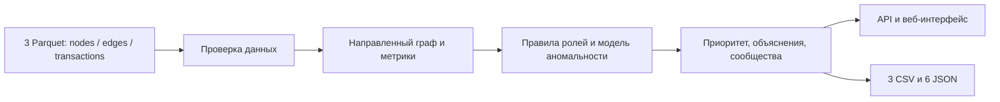

# TraceGraph — финансовый след

**Команда hackyou · HackAlem, кейс «Граф денег» · AI/ML-движок 0.3.1**

Локальное рабочее место аналитика: от трёх Parquet-файлов до объяснимых ролей участников, приоритетов проверки и графа переводов.

## Что решает

TraceGraph помогает выбрать участников финансовой сети для проверки и проследить основания гипотез до наблюдаемых переводов.
Он проверяет данные, строит направленный граф, выделяет сообщества, рассчитывает признаки и оценивает необычность профилей.
Роль описывает поведение в доступной выборке; приоритет помогает организовать работу аналитика.
Результат не устанавливает виновность и не является вероятностью нарушения.

**В веб-платформе:** кейсы, импорт и проверка Parquet, история наборов, запуск и отмена анализа, диаграммы, поиск и фильтры участников.
Карточка показывает потоки и основания роли; граф позволяет переходить по направленным связям; результаты можно скачать.
**В Python SDK:** операции и объяснения, до трёх автоматических шагов расследования, затем явное продолжение до пяти шагов; сохранение и восстановление ветки.
Три локальных аналитических агента дополнительно ищут совместимые по датам пути, групповые мотивы и альтернативные объяснения со ссылками на операции.
Свободного чата на естественном языке нет; досье агентов и шаги расследования доступны через SDK и пока не подключены к веб-интерфейсу.

**Шесть ролевых гипотез** назначаются всем узлам по прозрачным правилам:

| Роль | Минимальное условие допуска |
| --- | --- |
| `consolidator` — сборщик | Не менее двух отправителей и положительный входящий поток. |
| `transit` — транзит | Положительные вход и выход; доступен баланс потоков или временной проход. |
| `distributor` — распределитель | Не менее двух получателей и положительный исходящий поток. |
| `terminal` — конечный получатель | Положительный вход, нет исходящих связей; узел не на границе глубины наблюдения. |
| `coordinator` — координатор | Не менее двух достижимых seed, положительные вход и выход, посредничество или мост между сообществами. |
| `peripheral` — периферия | Ни одна допустимая гипотеза не достигает порога; сюда входят изоляты. |

Порог силы гипотезы — **0,45**, для координатора — **0,60**; разница двух лидирующих оценок не более **0,08** отмечает неоднозначность.
`role_score` учитывает уверенность в эвристической гипотезе и не равен её силе или калиброванной вероятности.
Аномальная ML-модель влияет на приоритет проверки с весом 10%; роли определяются наблюдаемыми признаками.
Формулы, ограничения seed и примеры: [методика ролей](docs/role-methodology.md).

## Как запустить

Требуются **Python 3.11+** (проверено на 3.12) и **Node.js 22.12+ или 24 LTS**.
Все команды выполняются из корня репозитория. Backend и движок используют разные окружения из-за версий зависимостей.
Базовая установка не требует PyTorch: модель `auto` использует доступный IsolationForest, что удобно для первого запуска.

**Windows PowerShell — установка:**

```powershell
python -m venv .venv
.\.venv\Scripts\python.exe -m pip install -r backend\requirements.txt
python -m venv .venv-engine
.\.venv-engine\Scripts\python.exe -m pip install -e ./ml
npm.cmd --prefix frontend ci
```

**Linux/macOS — установка:**

```sh
python3 -m venv .venv
.venv/bin/python -m pip install -r backend/requirements.txt
python3 -m venv .venv-engine
.venv-engine/bin/python -m pip install -e ./ml
npm --prefix frontend ci
```

**Запуск одной командой** после установки:

```powershell
.\.venv\Scripts\python.exe scripts\dev.py
```

В Linux/macOS: `.venv/bin/python scripts/dev.py`. Активация окружений не требуется.
Откройте [приложение на 127.0.0.1:5173](http://127.0.0.1:5173); [документация API](http://127.0.0.1:8000/docs) доступна отдельно.
`Ctrl+C` останавливает оба сервера. SQLite и миграции создаются автоматически; Docker не нужен.
Серверы слушают loopback; для одного каталога хранилища запускайте один API worker.

**Настройки по умолчанию** работают без `.env`; при необходимости задайте их в корневом `.env`, сохранив существующие значения:

```dotenv
TRACEGRAPH_STORAGE_DIR=./storage
TRACEGRAPH_MAX_FILE_BYTES=52428800
TRACEGRAPH_MAX_TABLE_ROWS=1000000
TRACEGRAPH_ENGINE_MODEL=auto
TRACEGRAPH_ANALYSIS_TIMEOUT_SECONDS=300
```

Интерпретатор движка выбирается автоматически: `.venv-engine/Scripts/python.exe` в Windows, `.venv-engine/bin/python` в Linux/macOS.
Переопределение: `TRACEGRAPH_ENGINE_PYTHON`; для явного выбора быстрой модели — `TRACEGRAPH_ENGINE_MODEL=isolation_forest`.
Лимит миллиона строк ограничивает импорт, но не означает подтверждённую производительность на миллионе узлов.
Опциональный CPU Autoencoder в Windows: `.\.venv-engine\Scripts\python.exe -m pip install -r ml\requirements-lock.txt`.
Установка для других ОС и подробности SDK: [инструкция движка](docs/ai-engine-readme.md); параметры платформы: [.env.example](.env.example).

## Какие технологии

| Часть | Реализация |
| --- | --- |
| Интерфейс | React, TypeScript, Vite, TanStack Query, React Router, SVG-граф. |
| API и история | FastAPI, Pydantic, SQLAlchemy, Alembic, SQLite. |
| Данные и признаки | Python, pandas, NumPy, PyArrow/Parquet, SciPy, NetworkX; сообщества Louvain. |
| ML | scikit-learn IsolationForest; опционально PyTorch Autoencoder на CPU. |
| Обогащение | Три локальных модуля с ограничением работы и времени, без LLM и внешних API. |
| Интеграция | Python SDK, CLI, CSV и JSON-снимки с проверкой целостности. |



Большие GID передаются в JSON строками без потери точности; суммы рассчитываются в целых тиынах.
Повторяющиеся операции и изоляты сохраняются. Контракт: [SDK и форматы](docs/ai-engine-contract.md).
Восстанавливаются снимки 0.2.0, 0.3.0 и 0.3.1; старые снимки сохраняют исходную методику ролей.

**Масштабирование до миллиона узлов.** Текущий прототип хранит граф NetworkX и снимок в памяти; такой масштаб не подтверждён.
Следующий этап — партиционированный Parquet, компактное CSR-представление или графовый движок, приближённые центральности,
ограниченные обходы от seed и серверная выдача небольших подграфов. Загрузка полного графа в браузер не требуется.

**Границы прототипа.** На графе есть подписи ролей, но пока нет раскраски по ролям и сообществам.
Гипотеза сообщества — шаблон по роли ведущего участника, а не отдельный вывод о назначении всей группы.
Наблюдение ограничено одним банком, июлем 2026 года, исходящим обходом до четвёртого колена и порогом 5 000 KZT.
Входы seed неполны; отсутствие выхода на границе не доказывает конечное получение. Дневные даты не задают порядок внутри дня.
Совместимые суммы и даты не доказывают движение одних и тех же средств. Ролевой разметки для оценки accuracy нет.

## Как проверить

**Быстрая демонстрация на синтетике:** три готовых файла находятся в `synthetic-demo/`.
Для воспроизведения: `.\.venv-engine\Scripts\python.exe ml/examples/generate_synthetic_data.py --output synthetic-demo`.
Это вымышленные данные для проверки рабочего сценария, без эталонной разметки ролей.

1. Запустите приложение, создайте кейс и загрузите `nodes.parquet`, `edges.parquet`, `transactions.parquet` из `synthetic-demo/`.
2. Нажмите «Проверить и сохранить»: ожидаются **38 узлов, 37 рёбер, 96 операций, 4 seed**, оборот **2 478 007,58 KZT**.
3. Запустите анализ. В наборе **14 узлов на границе глубины и один изолят**; проверьте диаграммы, фильтры и карточки.
4. Найдите `8600000000000003030`, откройте карточку и «Исследовать связи»: текущая гипотеза — `transit`; видны входы и выходы.
5. Проверьте `8600000000000004040`: отсутствие выхода на границе не должно само по себе давать `terminal`.
6. Проверьте изолят `8600000000000000404`: карточка доступна, наблюдаемых связей нет.
7. Скачайте три CSV из интерфейса и обновите страницу: сохранённый анализ и история должны открываться снова.

Граф показывает до 12 соседей с крупнейшими отдельными связями, их направление, суммы и число переводов; доступны переходы к соседям.
Это ограничение отображения: полный набор участвует в анализе и выгрузках.

**Данные кейса** уже включены в Git: `data/nodes.parquet`, `data/edges.parquet`, `data/transactions.parquet`; байты сверены с исходным архивом.
Контрольные значения: **2 248 узлов, 3 119 рёбер, 4 840 операций, 81 seed**, оборот **365 890 012,01 KZT**.
Для проверки только движка выполните одну команду после установки:

```powershell
.\.venv-engine\Scripts\python.exe -m tracegraph_ai --input ./data --output ./out --model isolation_forest
```

В `out/` появятся ровно **три CSV**: `nodes_roles.csv`, `clusters.csv`, `top_nodes.csv`.
SDK/CLI сохраняет полный снимок из девяти файлов: CSV и **шесть JSON** — `analysis_bundle.json`, `graph_bundle.json`, `transactions_bundle.json`,
`validation_report.json`, `model_info.json`, `manifest.json`. В интерфейсе доступны три CSV; JSON используются для восстановления и интеграции.

**Измерения:** свежий SDK-запуск синтетики занял **1,0915 с** на машине разработки; время зависит от оборудования и модели.
После чистой установки анализ синтетики через API с IsolationForest занял **8,17 с**; проверены выгрузки и карточки.
Для версии **0.3.1** ранее прошли **36 тестов движка и 9 адресных проверок API**, включая реальный запуск, выгрузки и восстановление.
В том измерении полный SDK-анализ данных кейса с Autoencoder занял **19,56 с**; установка зависимостей в это время не входит.
Это проверки работы алгоритмов и контрактов, а не точность выявления нарушений: [качество модели](docs/model-quality-review.md), [протокол проверок](docs/validation.md).

Для углублённого разбора доступны [обогащение расследований](docs/investigation-enrichment.md) и [метрики обогащения](docs/enrichment-metrics.md).
Перед сдачей: [соответствие требованиям и сценарий демонстрации](docs/submission-readiness.md), [сторонние компоненты и источники](docs/third-party-components.md).
