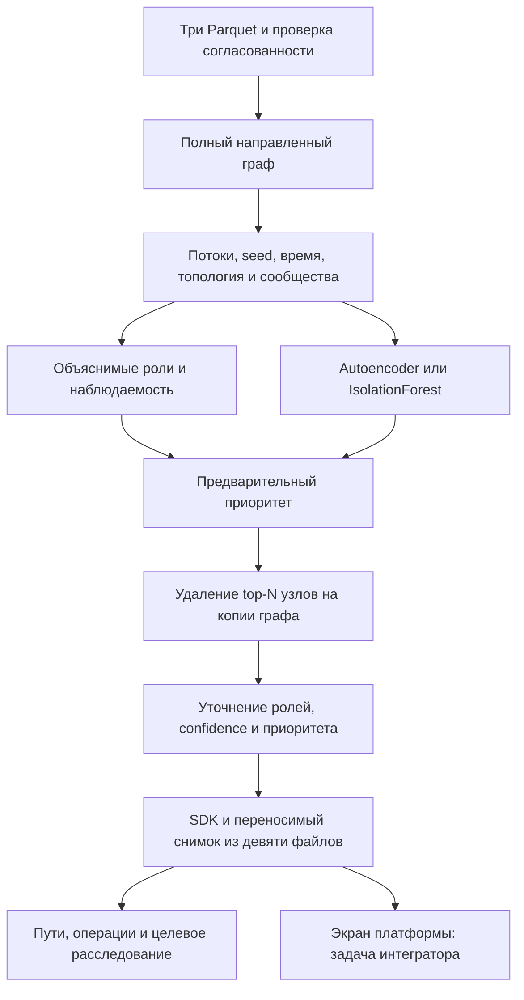

# TraceGraph AI — hackyou

Репозиторий команды **hackyou**, Finance: AML-case (AI & ZM).

TraceGraph AI **0.2.0** — локальный движок анализа наблюдаемой сети переводов. Он принимает три Parquet-файла, строит направленный граф, рассчитывает объяснимые гипотезы ролей, сообщества, необычность профилей и приоритет проверки. Для выбранного узла доступны подтверждающие операции, пути от seed, временные эпизоды и пошаговое расследование с дополнительными расчётами.

Результат этой реализации — Python SDK, CLI и артефакты для подключения к платформе. Инженер платформы реализует экран графа, HTTP-обёртку при необходимости, управление доступом и хранение сессий. Все расчёты движка выполняются на CPU; после установки зависимостей внешние API и ключи не требуются.

## Быстрый запуск

Команды выполняются из корня репозитория. Поддерживается Python 3.11+, проверяемая среда разработки — Python 3.12. Для примера в `data/` лежат `nodes.parquet`, `edges.parquet` и `transactions.parquet`.

Windows PowerShell, отдельное окружение без изменения системного Python:

```powershell
py -3.12 -m venv .venv
.\.venv\Scripts\python.exe -m pip install -e "./ml"
.\.venv\Scripts\python.exe -m tracegraph_ai --input ./data --output ./out
```

Linux / POSIX shell:

```sh
python3.12 -m venv .venv
. .venv/bin/activate
python -m pip install -e './ml'
python -m tracegraph_ai --input ./data --output ./out
```

Базовая установка включает IsolationForest. Для полной версии с Autoencoder установите CPU PyTorch в то же окружение. Windows:

```powershell
.\.venv\Scripts\python.exe -m pip install "torch>=2.4,<3" --index-url https://download.pytorch.org/whl/cpu
```

Linux, с активированной `.venv`:

```sh
python -m pip install 'torch>=2.4,<3' --index-url https://download.pytorch.org/whl/cpu
```

Используется [официальный способ установки PyTorch](https://docs.pytorch.org/get-started/locally/). Для другой ОС или архитектуры выбирайте подходящую CPU-сборку. Компоненты torchvision и torchaudio движку не нужны.

Проверенные версии зафиксированы в [`ml/requirements-lock.txt`](ml/requirements-lock.txt): Python 3.12, Windows x64, CPU torch и инструменты разработки. Для точного воспроизведения создайте чистую `.venv` и установите этот набор, затем пакет:

```sh
python -m pip install -r ml/requirements-lock.txt
python -m pip install ./ml --no-deps
```

В PowerShell без активации замените `python` на `.\.venv\Scripts\python.exe`. Файл lock уже содержит адрес официального CPU-индекса. Для разработки с редактированием исходников используется показанная выше установка `-e './ml'`.

После установки полный расчёт запускается одной командой:

```sh
python -m tracegraph_ai --input ./data --output ./out
```

Здесь и далее `python` означает интерпретатор созданной `.venv`; в PowerShell без активации используйте `.\.venv\Scripts\python.exe`. По умолчанию движок пробует Autoencoder и при недоступности или ошибке обучения переходит на IsolationForest. Выбранный backend и причина переключения видны в `out/model_info.json`.

Для явного выбора модели или собственных настроек:

```sh
python -m tracegraph_ai --input ./data --output ./out-if --model isolation_forest
python -m tracegraph_ai --input ./data --output ./out-config --config settings.json --seed 42
```

`settings.json` — JSON-объект с параметрами `AnalysisConfig`, например `{"model":"auto","counterfactual_top_n":25}`. Поля, ограничения и значения по умолчанию приведены в [контракте движка](docs/ai-engine-contract.md#настройки). Явные `--model` и `--seed` заменяют соответствующие значения файла. `--quiet` скрывает прогресс; итоговая JSON-сводка остаётся в stdout. Ошибки входа/настроек выводятся в stderr с кодом завершения 2.

## Что создаётся

| Файл | Содержание |
| --- | --- |
| `nodes_roles.csv` | Одна строка на узел: `gid, role, role_score, cluster_id, priority_score, evidence` |
| `clusters.csv` | `cluster_id, n_nodes, n_seed, sum_kzt_internal, top_gids, hypothesis` |
| `top_nodes.csv` | Все узлы в порядке приоритета: `rank, gid, role, priority_score, why`; первые 20 — Top-20 |
| `analysis_bundle.json` | Полные карточки узлов, признаки, роли, evidence, кластеры, конфигурация и отпечаток результата |
| `graph_bundle.json` | Направленные связи с объёмом и частотой, все узлы, включая изоляты |
| `validation_report.json` | Согласованность данных, распределения ролей/аномалий, устойчивость рейтинга, время этапов |
| `model_info.json` | Фактическая модель, признаки, подготовка данных, параметры обучения и fallback |
| `transactions_bundle.json` | Нормализованные операции с точной суммой в тиынах и техническими ссылками |
| `manifest.json` | Версия снимка, идентичность анализа и SHA-256 восьми остальных файлов |

Эти девять файлов образуют самостоятельный снимок анализа: его можно перенести интегратору и загрузить без исходных Parquet и повторного обучения.

CSV записываются в UTF-8 с запятой как разделителем. Короткое `evidence` в `nodes_roles.csv` содержит числа и ограничено 200 символами; подробные свидетельства доступны в JSON. В `clusters.csv` список `top_gids` разделён `;`.

Идентификаторы клиентов больше безопасного диапазона JavaScript Number. Во всём JSON `gid`, `src`, `dst` и списки клиентских ID — **десятичные строки**. В CSV сохраняется точная десятичная запись int64; при чтении в pandas используйте строковый dtype для ID, а в табличном редакторе импортируйте эти столбцы как текст. `cluster_id` — обычное целое число.

## Подключение из Python

```python
import json
from tracegraph_ai import TraceGraph

engine = TraceGraph({"model": "auto", "random_seed": 42})
analysis = engine.analyze(
    nodes_path="data/nodes.parquet",
    edges_path="data/edges.parquet",
    transactions_path="data/transactions.parquet",
    output_dir="out-sdk",
)

gid = engine.get_top_nodes(limit=1)[0]["gid"]  # точная десятичная строка
explanation = engine.explain_node(gid)
local_graph = engine.get_subgraph(gid, hops=1, start_date="2026-07-01", end_date="2026-07-10")
operations = engine.get_transactions(gid, direction="in", limit=100)
branch = engine.start_investigation(gid)

stored_state = json.dumps(branch, ensure_ascii=False, allow_nan=False)
# В другом процессе: загрузка сохранённого результата без обучения.
restored = TraceGraph.load_analysis("out-sdk")
# После явного действия аналитика «Продолжить»:
if branch["status"] == "checkpoint":
    branch = restored.continue_investigation(json.loads(stored_state))
```

Готовый пример запускает анализ, обращается к SDK и демонстрирует всю ветку:

```sh
python ml/examples/integrate.py --input ./data --output ./out-sdk
python ml/examples/integrate.py --load ./out-sdk --output ./out-restored
```

Пример сохраняет снимок, восстанавливает его новым экземпляром и продолжает сохранённую ветку. Дополнительно пишет `explanation.json`, `subgraph.json`, `transactions.json`, `investigation_checkpoint.json` и `investigation.json`. Пример имитирует действия продолжения; в платформе каждый шаг после checkpoint соответствует действию аналитика.

`analyze()` возвращает полную JSON-совместимую структуру; без `output_dir` файловые артефакты не создаются. Сохранить готовую сессию позже можно через `save_analysis(directory)`. Один экземпляр `TraceGraph` содержит один текущий анализ. Даты в фильтрах включительны: суммы и частоты рёбер подграфа пересчитываются по выбранным операциям, оценки узлов сохраняют смысл полного анализа. Полный справочник методов, форматов, ошибок и восстановления состояния — [контракт для интегратора](docs/ai-engine-contract.md).

## Как получаются выводы



Роли `consolidator`, `transit`, `distributor`, `terminal`, `coordinator`, `peripheral` выбираются по прозрачной комбинации потоков, графа, связи с seed и времени. Порог основной роли по умолчанию — 0,45, для coordinator — 0,60; разница до 0,08 отмечает неоднозначность. `coordinator` всегда означает кандидата для проверки. Формулы и допуски каждой роли описаны в [методике](docs/role-methodology.md).

Оценки имеют разные значения:

| Поле | Смысл |
| --- | --- |
| `role_scores`, `role_strength` | Поддержка каждой роли и сила выбранной гипотезы |
| `confidence` | Эвристическая надёжность с учётом независимых свидетельств и неполноты данных |
| `role_score` | Совместимое с официальным CSV отображение: **равно `confidence`**, также в JSON |
| `anomaly_score` | Относительная необычность профиля внутри текущей сессии |
| `priority_score` | Очерёдность проверки аналитиком |

Эти значения не являются калиброванными вероятностями. Нейромодель влияет на необычность и ограниченную долю приоритета; роли и confidence не присваиваются нейросетью. Подробности признаков, обучения и объяснений — [описание модели](docs/model.md).

## Ограничения данных и расследования

Предоставленный пример содержит 2 248 узлов, 3 119 рёбер, 4 840 операций и 81 seed за июль 2026 года; наблюдаемый оборот — 365 890 012,01 KZT. При default-конфигурации получено 91 сообщество. Изолированные seed и повторяющиеся строки операций сохранены. Размеры и число сообществ не зашиты в алгоритм.

Данные собраны по исходящим переводам до четвёртого колена, внутри одного банка и с порогом 5 000 KZT. Отсутствие исходящих у узла на границе не доказывает удержание средств. Вход seed неполон, поэтому его баланс не используется как полноценное наблюдение. Дневная точность дат не позволяет установить очередность внутри дня или движение одних и тех же денег. Ролевой разметки нет: отчёт показывает согласованность методики, а не accuracy ролей.

Расследование выполняет целевые расчёты: раскрывает наблюдаемые пути и операции, проверяет временные эпизоды, сравнивает допустимые роли и при необходимости измеряет эффект удаления выбранного узла вне предварительного Top-25. До трёх шагов выполняются автоматически, затем возвращается `checkpoint`; явное продолжение добавляет не более одного шага, всего не более пяти. Ветка может закончиться раньше. Новое измерение counterfactual может пересчитать гипотезу и confidence ветки по общей методике; повторный просмотр фактов уверенность не повышает. Исходный глобальный рейтинг сохраняется.

Платформа хранит JSON ветки и снимок анализа. Новый процесс вызывает `TraceGraph.load_analysis(directory)` и продолжает ветку с теми же `analysis_id` и `result_fingerprint`. Загрузчик проверяет версии, хеши и согласованность операций с графом; продолжение воспроизводит историю шагов. Контрольные суммы обнаруживают повреждение, но не являются подписью автора. Снимок требует совпадающей версии движка. Старые результаты 0.1 без manifest/операций нужно один раз пересчитать.

`explain_node()` показывает ограниченное число кратчайших путей от seed и ссылки на операции. Путь и совместимые даты не доказывают движение одних и тех же средств; очередность внутри дня неизвестна. Для проверки практической полезности предусмотрены [выборка случаев и шаблон обратной связи аналитика](docs/analyst-review.md).

## Воспроизводимость и рост объёма

Критерий кейса — полный пересчёт предоставленного графа менее чем за 5 минут. Результаты измерений и адресных проверок с указанием версии находятся в [отчёте проверки](docs/validation.md). Длительность конкретного анализа и этапов записана в `validation_report.json` → `runtime`. Таймер движка исключает первоначальный импорт модулей Python и завершающее копирование/обновление metadata; внешний секундомер процесса учитывает эти затраты. Установка зависимостей в расчёт не входит.

В метаданных сохраняются хеши входных файлов, настройки, версии и фактический backend. Повторяемость оценивается при одинаковой CPU-среде и версиях; переход на fallback меняет модель и идентичность анализа.

Пример SDK демонстрирует восстановление результата и продолжение ветки после JSON round-trip. Последовательность показа — в [сценарии демонстрации](docs/demo.md).

При росте до миллиона узлов текущие Python-словари, NetworkX и полный JSON графа потребуют пересмотра. Следующий вариант архитектуры должен читать/агрегировать Parquet частями, хранить граф в компактном CSR или специализированном графовом движке, оценивать betweenness выборочно и ограничивать reachability/удаления целевыми областями. Seed lineage можно считать пакетно с компактными множествами источников; временные признаки — потоковыми агрегациями. Для модели нужны пакетные выборки и явная стратегия обучения по периоду. Интегратор должен выдавать граф по фильтрам/страницам вместо загрузки миллиона карточек в браузер. Это направление масштабирования, а не реализованная возможность или обещание прежнего времени расчёта.

## Материалы и происхождение

Датасет, официальный кейс, AI/ML-спецификация и исходный starter предоставлены в `TraceGraph_AI_Codex_Final_Package.zip`. Starter использован как ориентир схемы входа, базовых метрик и обязательных CSV; аналитическое ядро реализовано в `ml/src/tracegraph_ai`. Согласно материалам пакета, обезличенные данные предоставлены для использования в рамках хакатона; отдельная лицензия на их дальнейшее распространение здесь не объявляется.

Используемые библиотеки: pandas, PyArrow, NumPy, NetworkX, SciPy, scikit-learn и опционально PyTorch. Структура работы и принятые решения сохранены в [плане](tasks/plan.md) и [списке задач](tasks/todo.md). Формат передачи платформе определяет [контракт SDK](docs/ai-engine-contract.md), правила вывода — [методика ролей](docs/role-methodology.md), ML-часть — [описание модели](docs/model.md).
