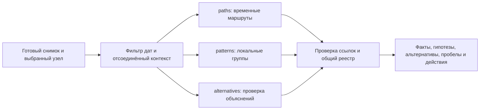

# Обогащение расследования локальными аналитическими агентами

TraceGraph AI 0.3.1 предоставляет `enrich_investigation()`: выбранный узел независимо рассматривают три специализированных вычислительных модуля, после чего движок собирает досье со ссылками на конкретные операции. Они работают с готовым снимком анализа и выбранным периодом. Модель повторно не обучается, LLM не вызывается, внешние источники и API-ключи не требуются.

Обогащение — отдельный запрос SDK. Оно не продолжает пятишаговую ветку `start_investigation()` и не расходует её шаги. Исходные role, confidence, priority и fingerprint анализа сохраняются. Результат используется для проверки оснований гипотезы и выбора следующего действия аналитика.

## Запуск на сохранённом анализе

Из корня репозитория, с установленным пакетом 0.3.1 в отдельной `.venv-engine`, Windows PowerShell:

```powershell
.\.venv-engine\Scripts\python.exe ml/examples/enrich_investigation.py --analysis ./out --output ./out-enrichment
```

Без `--gid` выбирается первый узел по приоритету. Для конкретного узла и включительного диапазона дат:

```powershell
.\.venv-engine\Scripts\python.exe ml/examples/enrich_investigation.py --analysis ./out --gid 100000000011452100 --start-date 2026-07-01 --end-date 2026-07-15 --output ./out-enrichment-node
```

В Linux используйте `python` из активированной `.venv-engine`. `--analysis` принимает полный совместимый снимок 0.2.0, 0.3.0 или 0.3.1: исходные Parquet и повторный расчёт аномальностей не нужны. Скрипт пишет `enrichment.json` и `dossier.md`; ссылки в Markdown ведут к выводам и встроенному реестру операций. Полные списки метрик и ссылок остаются в JSON. Статус `partial` сохраняется как пригодный для просмотра ограниченный результат; ошибка загрузки или `failed` дают код завершения 2.

В коде платформы:

```python
from tracegraph_ai import EnrichmentConfig, TraceGraph

engine = TraceGraph.load_analysis("out")
gid = engine.get_top_nodes(1)[0]["gid"]
report = engine.enrich_investigation(
    gid,
    EnrichmentConfig(start_date="2026-07-01", end_date="2026-07-31"),
    progress=lambda event: print(event),
)

for hypothesis in report["dossier"]["hypotheses"]:
    print(hypothesis["title"], hypothesis["status"])

# Достать операции, не поместившиеся во встроенный реестр досье.
missing = report["dossier"]["omitted_tx_ids"]
if missing:
    page = engine.get_transactions(tx_ids=missing, offset=0, limit=1000)
```

Для следующих страниц используйте `offset` и `has_more`. Набор ID привязан к исходному анализу; это технические номера строк, а не банковские идентификаторы транзакций.

## Три направления проверки



| Агент | Что рассчитывает | Граница вывода |
| --- | --- | --- |
| `paths` | Направленные маршруты от seed к цели, для которых конкретные операции имеют неубывающие даты. Поиск учитывает альтернативы топологически кратчайшему пути. | Область, число узлов, глубина и количество путей ограничены. Один найденный маршрут не описывает все возможности; сам seed не считается нулевым путём от независимого источника. |
| `patterns` | Сбор и распределение у цели, общие отправители/получатели, близкие по датам эпизоды, возвратные маршруты длиной два или три ребра; внутренние и внешние потоки локальной группы. | Окрестность — максимум два шага и до 200 узлов текущей реализации. Общий контрагент и возвратный путь не устанавливают общий контроль или тождество денег. |
| `alternatives` | Зависимость от одного контрагента/крупного перевода, концентрация по дням, чувствительность окон `0/W/2W` и исключения крупнейшей операции, неполнота входа seed и границы выгрузки. | Исключение операции — диагностический сценарий; строка и исходная роль сохраняются. Обычное объяснение пакета расчётов может быть предложено только как непроверенная альтернатива. |

Для временной чувствительности `alternatives` ограничивает неделимый вызов существующего расчёта: до 2 000 локальных операций, 366 активных дней и базовое окно до 30 дней. При превышении возвращаются явный пропуск и рекомендация сузить область; пропуск не означает устойчивость или отсутствие признака.

Каждый вывод имеет `kind`: `observation` для наблюдений, `inference` для интерпретации либо `limitation` для ограничения. Код гипотезы входит в `supports` или `weakens` только как основание дальнейшей проверки. Используются гипотезы `seed_connected`, `rapid_relay`, `coordinated_group`, `collection`, `distribution`, `return_flow`.

## Настройки и вычислительные ограничения

`config` принимает `None`, `EnrichmentConfig` или словарь. Для `None`/словаря без временного окна берётся `temporal_window_days` исходного анализа; экземпляр `EnrichmentConfig` использует собственное значение.

| Поле | По умолчанию | Допустимо / смысл |
| --- | ---: | --- |
| `start_date`, `end_date` | `None` | ISO `YYYY-MM-DD`, обе границы включительны; пропуск оставляет сторону периода открытой. |
| `max_hops` | 8 | 1..16 рёбер при поиске путей; поиск возвратов ограничен тремя рёбрами. |
| `max_paths` | 5 | 1..20 маршрутов; также ограничивает количество показываемых возвратов. |
| `max_local_hops` | 2 | 1..2 шага для локальной группы. |
| `max_nodes` | 200 | 1..1000; `patterns` дополнительно ограничивает свою группу 200 узлами. |
| `max_results` | 10 | 1..20 выводов на агента; отдельные агенты также ограничивают этим числом списки мотивов. |
| `max_transactions` | 100 | 1..1000 строк во встроенном реестре досье. Ссылки агента сохраняют минимальное подтверждение вывода даже при превышении этого числа; подробности ниже. |
| `temporal_window_days` | 2 | 1..30 дней для групповых эпизодов и временной чувствительности. |
| `total_work_budget` | 150 000 | 30..3 000 000 условных единиц; целочисленно делится на три фиксированные квоты. |
| `timeout_seconds` | 15 | 0,01..60 секунд, общий срок для трёх агентов. |

При настройках по умолчанию каждый агент получает 50 000 единиц работы. Это счётчики проверок/просматриваемых элементов, а не количество токенов или точных процессорных инструкций. Три модуля запускаются через `ThreadPoolExecutor` в рамках одного запроса; Python-потоки не гарантируют ускорение CPU-расчётов втрое.

Ограничение времени **кооперативное**: агент проверяет общий deadline в контрольных точках и прекращает дальнейший поиск. Подготовка контекста, неделимый вызов библиотеки и сборка отчёта могут завершиться после указанного срока. Процесс/поток принудительно не уничтожается. Фактическое время и `deadline_exceeded` находятся в `runtime`, израсходованные квоты — в `agents[].usage`. Для жёсткого прекращения работы платформа должна выполнять запрос в отдельном управляемом процессе.

## Формат досье и статусы

Верхний уровень отчёта:

```text
schema_version, enrichment_version=1, engine_version, analysis_id,
result_fingerprint, enrichment_id, target_gid, status, execution_mode,
scope, config, base_hypothesis, global_analysis_unchanged,
agents, dossier, dossier_fingerprint, runtime
```

`execution_mode="local_analytical_agents"`. Даты ограничивают наблюдения агентов; `scope.node_scores="full_analysis"` напоминает, что исходные роли и confidence относятся ко всему анализу. Исходный снимок может быть создан версией 0.2.0, а отчёт обогащения — исполняющей версией 0.3.1.

| Статус | Значение |
| --- | --- |
| Отчёт `complete` | Все агенты завершили свои ограниченные расчёты. Это не утверждение об исчерпывающем поиске за пределами настроенной области. |
| Отчёт `partial` | Как минимум один агент ограничен бюджетом/выдачей или завершился ошибкой, а другие результаты доступны. |
| Отчёт `failed` | Все три агента завершились ошибкой. Отсутствие выводов нельзя интерпретировать как отсутствие признаков. |
| Агент `complete`, `partial`, `error` | Состояние конкретного направления; при ошибке доступны `error` и ограничение, при лимите — `usage.limit_reason`. |

Помимо статуса всегда проверяйте ограничения области в `agents[].details` и `limitations`: границы поиска, непроверенные seed, усечённые группы, пропущенные вычисления, частичные проходы. `runtime` содержит elapsed time, общий объём работы, `cache_hit` и описание бюджетов. `trace` — компактная диагностика выполнения, а не журнал мыслительного процесса.

`dossier` содержит:

- `facts`: фактические наблюдения со стабильными `finding_id`.
- `hypotheses`: основания за/против, `supporting_finding_ids`, `weakening_finding_ids`, пересекающиеся `overlapping_tx_ids` и статус `observed_support`, `mixed_evidence` либо `not_established`.
- `alternative_explanations`: ослабляющие основания, ограничения и явно неподтверждённые альтернативы; `findings` содержит полный общий список.
- `evidence_ledger`: выбранные исходные операции с `evidence_id="T-<tx_id>"`, датой, строковыми ID участников и точной суммой `sum_tiyn`.
- `referenced_transaction_count`, `evidence_ledger_truncated`, `omitted_tx_ids`: размер объединения ссылок и операции, которые можно запросить отдельно.
- `recommendations`, `next_action`: предметные действия с приоритетом, причиной, параметрами узла/операций/периода и указанием предложивших агентов.
- `summary_points`, `limitations`: краткие выводы со ссылками и ограничения общего результата.

Встроенный реестр по умолчанию ограничен 100 строками. `omitted_tx_ids` относится к операциям, на которые выводы уже сослались, но которые не поместились в реестр. Если сам агент ограничил число найденных путей или ссылки конкретного вывода, полный невыполненный поиск не превращается в список `omitted_tx_ids`: смотрите его отдельные счётчики и флаги усечения.

Минимальный набор операций, на котором держится найденный мотив, сохраняется в ссылках вывода целиком. Например, для общих контрагентов нужны операции целевого узла и другого участника, а для возвратного пути — все его рёбра. Эти обязательные ссылки могут превышать `max_transactions`; `minimum_witness_tx_ids` и `reference_cap_extended_for_witness` поясняют расширение там, где оно применяется. Ограничение количества строк `dossier.evidence_ledger` остаётся строгим: недостающие записи перечисляются в `omitted_tx_ids` и запрашиваются через `get_transactions()`. Таким образом, маленький реестр не удаляет из самого вывода ссылку на обязательного участника или ребро пути.

Агенты используют общие исходные данные. Пересечение операций в поддерживающих выводах явно сохраняется, а число совпавших мнений не переводится в новый confidence. Отсутствие альтернативного объяснения также не повышает confidence. Дневные даты не устанавливают порядок внутри дня, а совпадение сумм не устанавливает тождество средств.

## Кэш, сохранение и интеграция

`use_cache=True` сохраняет до восьми отчётов со статусом `complete` в экземпляре движка. Ключ учитывает анализ, fingerprint результата, выбранный узел, настройки и версии обогащения/движка. При заполнении удаляется наиболее рано сохранённый отчёт. `use_cache=False` обходит чтение и запись кэша. Отчёты `partial`/`failed` в него не попадают.

Возвращается отдельная копия. Кэш не входит в девять файлов снимка и не переносится между процессами; платформа сохраняет `enrichment.json` отдельно. При попадании в кэш `runtime.cache_hit=true`, время текущего вызова обновляется, а данные использования агентов описывают исходный расчёт. `enrichment_id` идентифицирует запрос, `dossier_fingerprint` — содержимое без времени выполнения и trace; достижение временного лимита может изменить фактически успевший сформироваться результат.

`progress(event)` получает события `started`, `agent_completed`, `completed`, либо `cache_hit`. Callback выполняется в вызывающем потоке; он должен быть коротким и не выбрасывать исключения. Метод синхронный: возвращает отчёт после завершения текущих агентных задач. Другие методы того же экземпляра не следует вызывать параллельно из приложения.

Движок 0.3.1 загружает совместимые снимки 0.2.0, 0.3.0 и 0.3.1. При повторном сохранении старого снимка версия создавшего анализ движка остаётся в metadata/manifest. Для снимков 0.2.0/0.3.0 без `role_methodology_version` runtime использует v1 без изменения сохранённой конфигурации и карточек. Новые анализы по умолчанию используют v2 с `confidence_breakdown`; обогащение не переводит старые оценки на новую методику и не добавляет это поле задним числом. Результаты 0.1 без операций и manifest требуют полного пересчёта. Обогащение имеет собственную версию и не подменяет историю пятишаговой ветки.

## Проверки и измерения

Для воспроизводимой оценки на подготовленном снимке:

```powershell
.\.venv-engine\Scripts\python.exe ml/examples/evaluate_enrichment.py --analysis ./out --output ./out-enrichment-eval
```

Скрипт создаёт `enrichment_metrics.json` и `enrichment_metrics.md`. На небольших синтетических сценариях с известными путями/возвратами считаются TP/FP/FN/TN и precision/recall именно этих задач, проверяются даты маршрутов, ссылки и сохранность исходного анализа. Для реальных узлов без эталонной разметки измеряются время, статусы и целостность ссылок; precision/recall остаются `null`.

Смотрите параметры и фактические результаты созданного отчёта. Показатели относятся к конкретной выборке и конфигурации. Размеченных экспертами ролей в исходном наборе нет; технические проверки не дают accuracy выявления нарушений и не подтверждают практическую полезность каждой гипотезы. Для неё предусмотрен [разбор случаев аналитиком](analyst-review.md).

Сохранённые [метрики обогащения](enrichment-metrics.md) получены на версии 0.3.0. Их следует читать как исторический прогон; они не являются измерениями новой версии 0.3.1.
