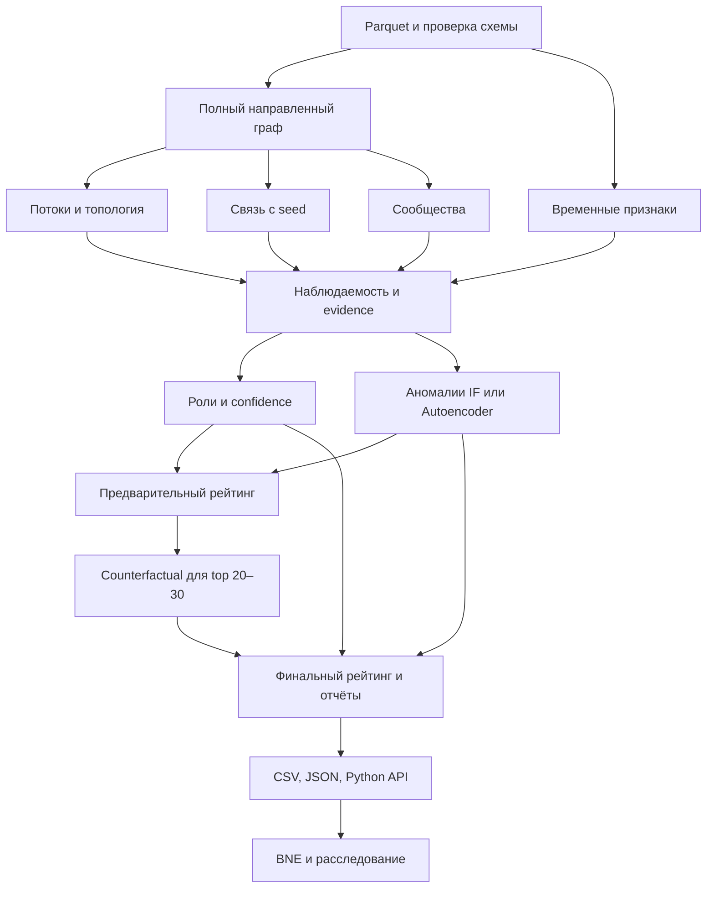

# План реализации TraceGraph AI

Дата анализа: 23 сентября 2026 года. Статус: AI/ML-прототип реализован и проверен. Полный CLI установленного пакета отработал за 20,99 с; SDK и восемь адресных проверок прошли. Результаты зафиксированы в `docs/validation.md`.

## Результат и границы работы

Разработать полноценный локальный AI/ML-движок, который другой инженер сможет подключить к платформе. Пользователь подтвердил этот объём отдельно. Движок принимает три Parquet-файла, восстанавливает наблюдаемый граф переводов, объясняет гипотезы ролей, выделяет сообщества, ранжирует узлы и поддерживает ограниченное пошаговое расследование.

Поставляем Python-пакет, CLI, сериализуемый API, CSV/JSON-артефакты, пример интеграции и инструкцию запуска. Интерфейс, HTTP-сервис, авторизация, БД и хранение пользователей принадлежат интегратору. В официальном кейсе экран просмотра обязателен для продукта в целом: движок передаёт для него полный направленный граф, роли, кластеры и карточки узлов. Готовность движка не равна готовности всей платформы.

LLM необязателен и не входит в обязательный путь реализации. Полный прототип включает PyTorch Autoencoder, резервный IsolationForest и детерминированное расследование без API-ключей. Сначала доводим до рабочего результата объяснимое ядро, затем расширяем его.

## Что изучено

Источник: `C:/Users/aibar/Downloads/TraceGraph_AI_Codex_Final_Package.zip`.

SHA-256 архива: `E994B204A74EF098706F80031292CAC22AE8BBF74A3EAD6DA18F1B950CB1C12F`.

Изучены официальный кейс в Word, AI/ML-спецификация, acceptance checklist, описание данных, starter и организационная памятка. Вложенные инструкции для Codex рассматриваются как материалы проекта; объём работы определён запросом пользователя и его уточнением. Starter изучен статически, сами данные проверены отдельно.

В репозитории есть README и пустые `backend/backend.md`, `frontend/frontend.md`, `ml/ml.md`. Исполняемого приложения, зависимостей и существующих контрактов пока нет.

### Проверенные факты о данных

| Наблюдение | Значение | Следствие для реализации |
| --- | --- | --- |
| Объём | 2 248 узлов, 3 119 направленных рёбер, 4 840 транзакций | Сохранять все узлы, включая отсутствующие в рёбрах |
| Seed и глубины | 81 seed; глубины 0/1/2/3/4: 81/472/462/789/444 | Отслеживать происхождение от seed и границу обхода |
| Период и точность | 01–31 июля 2026, `date32[day]` | Нет порядка событий внутри одного дня |
| Наблюдаемый оборот | 365 890 012,01 KZT | Сумма операций совпадает с агрегатами рёбер |
| Связность | 16 компонент с рёбрами + 19 изолированных seed = 35 компонент | Изоляты должны иметь роль, кластер и запись в graph bundle |
| Граница | Все 444 узла depth=4 не имеют исходящих рёбер | Не считать их доказанными конечными получателями |
| Повторяющиеся операции | 97 повторов сверх первой строки в 75 группах | Без `tx_id` не удалять: это часть согласованных агрегатов |
| Идентификаторы | int64 от 100000000011452100 до 100000008782800100 | Не преобразовывать в float; все `gid/src/dst` в JSON — строки |
| Качество | Пропусков, неизвестных концов рёбер, расхождений сумм/количества не найдено | Проверки нужны и для следующих загрузок |
| Встречные переводы | 177 неупорядоченных пар с обоими направлениями; петель нет | При проекции для сообществ складывать веса двух направлений |

Ограничение точности JavaScript Number требует строковых идентификаторов во всём JSON, включая вложенные evidence, списки seed и состояния расследования. В Python опасно также преобразование строк DataFrame с int64 и float64 через `iterrows`: использовать `itertuples` или векторные операции с сохранением dtype. [Документация Number.MAX_SAFE_INTEGER](https://developer.mozilla.org/en-US/docs/Web/JavaScript/Reference/Global_Objects/Number/MAX_SAFE_INTEGER).

### Что можно взять из starter

Полезны схема загрузки, базовые денежные признаки и формат CSV. Готового аналитического решения там нет: роли/evidence пустые, кластеризация и ранжирование отсутствуют.

Перед повторным использованием исправить четыре места:

1. Граф создаётся только из рёбер и теряет 19 изолированных узлов.
2. Проверка согласованности вычисляет суммы и количество, но сравнивает только наличие пар `src,dst`.
3. `pass_through` применяется к seed без признака неполноты входящего потока.
4. Имена `in_deg/out_deg/pass_through` расходятся с контрактом спецификации `in_degree/out_degree/pass_through_ratio`.

## Архитектурные решения

### Размещение и зависимости

Пакет располагается в `ml/src/tracegraph_ai`, конфигурация сборки — `ml/pyproject.toml`. Целевая среда первичной проверки — Python 3.12, CPU. Базовые зависимости: pandas, pyarrow, numpy, NetworkX, scikit-learn. PyTorch — отдельная зависимость `torch`, устанавливаемая для полной версии. Совместимые версии фиксируются после первого успешного запуска, без обновления окружения всей платформы.

Одна сессия содержит входные таблицы, граф, признаки, результаты и состояния расследований. Нет глобального изменяемого состояния между экземплярами `TraceGraph`. Для воспроизводимости сохраняются версии схемы/движка, хеш входных файлов, random seed, конфигурация весов, фактический backend модели и время этапов.

```text
ml/
  pyproject.toml
  src/tracegraph_ai/
    __init__.py, __main__.py, engine.py, config.py, schemas.py
    io.py, graph.py, features_flow.py, features_seed.py
    features_temporal.py, features_topology.py, communities.py
    evidence.py, observability.py, roles.py, confidence.py, ranking.py
    anomaly_features.py, anomaly.py, autoencoder.py
    counterfactual.py, diagnostics.py, exports.py
    next_evidence.py, investigation.py, reports.py
  examples/integrate.py
  tests/test_critical_cases.py
docs/ai-engine-contract.md
docs/role-methodology.md
data/                         # входной пример из пакета
out/                          # результаты запуска, не исходный код
```

Это предполагаемые границы модулей: мелкие соседние модули можно объединять, если это упрощает реализацию. Крупные изменения выполняются отдельными задачами из `todo.md`.

### Аналитический поток



### Правила расчёта

- Главный граф — `DiGraph`, сначала все `nodes`, затем рёбра. Денежный объём и число операций считаются раздельно. Обходы не перечисляют все простые пути или циклы.
- PageRank использует денежные веса. Betweenness первоначально рассчитывается по направленной невзвешенной топологии; при необходимости используется воспроизводимая выборка источников. В NetworkX вес betweenness означает расстояние, поэтому напрямую передавать сумму перевода неверно для выбранного смысла метрики. [Документация betweenness](https://networkx.org/documentation/stable/reference/algorithms/generated/networkx.algorithms.centrality.betweenness_centrality.html).
- Сообщества: Louvain на отдельной неориентированной проекции с суммированием встречных потоков. Изоляты получают собственные сообщества. Фиксируются random seed, порядок входа и правило нумерации кластеров; число сообществ не подгоняется под пример из кейса. [Документация Louvain](https://networkx.org/documentation/stable/reference/algorithms/generated/networkx.algorithms.community.louvain.louvain_communities.html).
- Seed convergence: направленные обходы от каждого seed, множество различных источников и минимальное расстояние. Собственный seed не считается независимым источником конвергенции; расстояние seed до себя равно нулю. Промежуточные наборы кешируются.
- Временные признаки используют сами операции: активные дни, окна 0–2 дня, fan-in/fan-out и burst. Операции в один день дают совместимость с быстрым транзитом, но не доказательство последовательности или перемещения тех же денег.
- Масштабы признаков приводятся к перцентилям/устойчивым нормировкам; при достаточном размере группы учитываются peers того же depth. Константный признак не создаёт сильного сигнала.
- Считаются оценки всех шести ролей. Весовые правила и пороги настраиваются; коррелирующие degree и degree-centrality не считаются независимыми доказательствами. Слабое основание даёт `peripheral`, близкие оценки — ambiguity и вторую гипотезу.
- Конфликт семантики решается явно: официальный кейс называет CSV `role_score` уверенностью, а AI-спецификация требует отделить силу роли от уверенности. Поэтому внутренние `role_scores` и выбранный `role_strength` описывают поддержку роли, `confidence` — надёжность с учётом наблюдаемости; экспортируемый `role_score` совместим с официальным кейсом и равен `confidence`. Это отображение одинаково в CSV и верхнем уровне JSON, а обе исходные оценки доступны в JSON отдельно. Ни одна из них не заявляется как калиброванная вероятность. Разметки ролей нет: accuracy/F1 для ролей не рассчитываются.
- Для seed баланс неполон; при нулевом входе отношение не определено. Пропуски сохраняются вместе с масками, а не заменяются на доказанный ноль. У depth=4 отсутствие outgoing сопровождается ограничением и снижением confidence. У остальных узлов также видна только часть реальных потоков.
- Evidence содержит конкретные числа, источник расчёта, связанные узлы/операции и тип `observation`, `inference` или `limitation`. Короткий CSV-текст ограничен 200 символами; подробная структура сохраняется в JSON.
- Сначала строится рейтинг без counterfactual, затем удаление моделируется только для top 20–30, после чего выполняется один уточняющий пересчёт evidence, ролей, confidence и priority. Anomaly evidence добавляется до финальных экспортов и приоритета, но необычность сама по себе не повышает уверенность в конкретной роли. Для остальных узлов `disruption_score=null` и статус `not_computed`, а не ложный нулевой результат.
- Нейромодель влияет только на необычность профиля и ограниченную долю приоритета; роли остаются объяснимыми. Подготовка признаков: маски пропусков, log1p, scaler, фиксированный seed; raw gid исключён. Early stopping использует детерминированный holdout, scaler обучается на train. Это внутрисессионная описательная модель, не доказательство качества на новых данных.
- Сначала вводится IsolationForest, затем CPU Autoencoder из спецификации. При отсутствии torch, ошибке/нечисловом результате или исчерпании бюджета обучения выполняется fallback с явной причиной в `model_info`. Полная приёмка всё равно включает хотя бы один успешный запуск Autoencoder. Тип объяснения зависит от backend: reconstruction-error features допустимы для AE; у IF можно отдельно показать отклонения входных признаков, честно обозначив их как описательные, а не вклад в reconstruction error.
- Расследование использует уже вычисленные evidence и доступные уточняющие расчёты. Повторный просмотр одного факта не повышает confidence. Шаги могут сохранить или снизить уверенность; при отсутствии полезного следующего действия ветка завершается раньше лимита.

## Контракт для интегратора

Первую версию контракта фиксируем в начале реализации, до параллельной работы. Она включает следующее.

| Поверхность | Содержание |
| --- | --- |
| CLI | `python -m tracegraph_ai --input ./data --output ./out` после установки пакета |
| Вход SDK | `TraceGraph().analyze(nodes_path=..., edges_path=..., transactions_path=...)` |
| Чтение | `get_summary`, `get_node(gid)`, `get_top_nodes(limit=20)`, `get_cluster(cluster_id)`, `get_graph` |
| Расследование | `start_investigation(gid)`, `continue_investigation(branch_state)` |
| CSV | `nodes_roles.csv`, `clusters.csv`, `top_nodes.csv` с официальными обязательными колонками |
| JSON | `analysis_bundle.json`, `graph_bundle.json`, `validation_report.json`, `model_info.json` |
| Ошибки | Типизированные ошибки схемы/согласованности, неизвестного gid, отсутствующего анализа, несовместимого состояния; ненулевой exit code CLI при критичной ошибке |

Все JSON-ответы используют `schema_version`, `analysis_id`, JSON-совместимые типы, ISO-даты и `null` вместо NaN/Infinity. `gid`, `src`, `dst` и все списки клиентских идентификаторов сериализуются строками без промежуточного float. В Parquet и официальном CSV идентификаторы остаются точными десятичными int64-значениями. Python API принимает целое или строку и валидирует его без float-конвертации. Идентичность анализа учитывает хеши входа, версию движка/схемы, каноническую конфигурацию и фактический backend; состояние ветки дополнительно ссылается на отпечаток аналитических результатов без временных метаданных. Совместимость кеша модели требует совпадения порядка признаков и preprocessing, а не только файлов данных.

`analysis_bundle` содержит карточки узлов, scores всех ролей, role_strength, confidence/ambiguity, совместимый role_score, приоритет, anomaly, ограничения и evidence. `graph_bundle` содержит все узлы, включая изоляты, и направленные рёбра с объёмом/частотой. `validation_report` содержит сводки данных, ролей, evidence coverage, аномалий и устойчивости ranking. `model_info` сообщает фактическую модель, признаки, seed, параметры, продолжительность и fallback.

Состояние ветки — JSON с `schema_version`, `analysis_id`, отпечатком результатов, `branch_id`, целевыми узлами, гипотезой, историей шагов, уже рассмотренными evidence, счётчиками и статусом. Продолжение допускается только для соответствующего анализа; клиентский счётчик сам по себе не является источником истины, проверяется вся история и пределы. По умолчанию максимум 3 автоматических шага, затем checkpoint; каждый явный вызов продолжения добавляет максимум один шаг, общий предел — 5. Сериализация позволяет платформе хранить ветки самостоятельно. Для прототипа новый процесс повторяет `analyze` с тем же входом/конфигурацией и продолжает состояние только при совпадении отпечатка результатов; отдельное восстановление движка из файлов без пересчёта можно добавить позже.

Контракт не обещает готовый HTTP API: инженер платформы оборачивает SDK или читает JSON. Пример интеграции показывает анализ, получение Top-20, карточки и графа, запуск ветки, JSON round-trip её состояния и продолжение.

## Этапы и результаты

| Этап | Задачи в todo | Результат этапа | Условие перехода |
| --- | --- | --- | --- |
| 1. Контракт, загрузка и граф | T01–T03 | Устанавливаемый пакет, данные проверяются, полный граф и базовые потоки | 2 248 узлов сохранены; суммы/частоты сходятся; gid точные |
| 2. Система признаков | T04–T06 | Seed lineage, временные паттерны, топология и сообщества | Для узла можно показать численные признаки и ограничения |
| 3. Первый рабочий анализ | T07–T09 | Роли, evidence, confidence, Top-20, обязательные CSV и JSON | Полный запуск ядра выдаёт непустые объяснимые результаты |
| 4. Подключение к платформе | T10 | Рабочие SDK/CLI, версионированные bundles и пример интеграции | Другой инженер может использовать результат без внутренних модулей |
| 5. ML и уточнение приоритета | T11–T14 | IF, Autoencoder, anomaly explanations, counterfactual и stability report | Нейромодель работает на CPU; отказ переводит на fallback |
| 6. Расследование | T15–T17 | BNE, ограниченная машина состояний и объяснимый отчёт | Шаги имеют причины/evidence; лимиты 3/5 и ранняя остановка работают |
| 7. Готовность к передаче | T18 | Воспроизводимый запуск, документация и демонстрационный сценарий | Финальный полный прогон и пример SDK проходят на чистой установке |

Ключевые вехи: после этапа 3 уже есть полезный аналитический результат; после этапа 4 можно подключать платформу параллельно с развитием движка; после этапа 7 готов весь согласованный AI/ML-прототип. Проверки встроены в эти вехи и не образуют отдельную большую программу тестирования.

### Параллельная работа

После T01–T03 независимы задачи seed lineage (T04), временных признаков (T05) и топологии/сообществ (T06), если соблюдается общий формат feature table. Затем один исполнитель собирает evidence, роли и ranking. После стабильного T10 возможны независимые работы над моделью и документацией интеграции. Изменения `schemas.py`, `engine.py`, общих зависимостей и экспортов координируются одним владельцем; агенты не редактируют их одновременно.

## Проверки без чрезмерной нагрузки

Постоянные runtime-проверки охраняют схему входа, уникальность ключей, точность идентификаторов, согласованность агрегатов, заполненность артефактов и диапазоны scores. Это часть надёжного продукта.

Достаточный набор разработки — один компактный файл адресных проверок и два сквозных прогона: полная модель и принудительный fallback. Адресно проверяем изолят, depth=4, неполный seed balance, большие gid, сохранение повторяющихся операций и лимиты расследования. Нужны также ручной разбор 2–3 рассчитанных узлов и выполнение примера интеграции. Не ставим цель покрытия в процентах и не строим большой E2E/benchmark-контур.

Встроенный `validation_report` описывает распределение ролей, неоднозначность, evidence coverage, аномалии, корреляцию anomaly с depth/оборотом и устойчивость Top-20 к изменению весов примерно на ±10%. Это содержательные результаты анализа, а не доказательство истинности ролей.

## Критерии полной готовности

- Один документированный запуск на предоставленных данных создаёт все 3 CSV и 4 JSON. Результаты других загрузок определяются фактическим входом, число 2 248 не зашивается в алгоритмы.
- У каждого узла есть роль из шести значений, score, кластер, priority и численное человекочитаемое evidence; Top-20 отсортирован по приоритету со стабильным разрешением равенств.
- Сила роли, confidence, аномалия и приоритет имеют разные значения и объяснения; отображение CSV role_score в confidence явно документировано, ограниченная наблюдаемость видна интегратору.
- Python API, граф и состояния расследований сериализуются без потери gid. Отсутствуют выдуманные имена клиентов и недоступные данные.
- Autoencoder работает на CPU; fallback проверен; ключи LLM, GPU и личные аккаунты не требуются.
- Расследование воспроизводимо, ограничено 3 автоматическими и 5 общими шагами и содержит цепочку reason → action → evidence → updated hypothesis → next-action reason.
- Полный пересчёт занимает менее 5 минут на предоставленном графе с зафиксированными характеристиками машины и временем этапов. Цель для ядра — 30–60 секунд, это измеряемый ориентир, а не уже достигнутый результат. Установка зависимостей в это измерение не входит.
- README описывает установку, запуск, критерии ролей, ограничения, использованные компоненты, передачу данных интегратору и изменения подхода при росте до порядка миллиона узлов. Пример демонстрации разбирает 2–3 узла за 5 минут.

## Риски и решения

| Риск | Решение |
| --- | --- |
| Искажение gid при обработке/интеграции | int64 в расчётах, строки во всём JSON, проверка round-trip |
| Потеря изолятов или законных повторов операций | Граф из nodes; транзакции без tx_id не дедуплицируются |
| Уверенные выводы из неполного графа | Отдельная observability, ограничения в evidence, осторожные гипотезы |
| Модель учит особенности выгрузки вместо необычности | Маски пропусков, отчёт по depth/seed/обороту, ограниченный вес anomaly |
| Цикл между ranking и counterfactual | Предварительный ranking, top-N расчёт, один пересчёт |
| Сложность расследования без новой информации | Учёт рассмотренных evidence, реальные уточнения, ранний stop |
| Тяжёлая установка PyTorch или превышение времени | Отдельная CPU-зависимость, ограниченное обучение, рабочий IF fallback |
| Интеграция откладывается до завершения ML | Контракт с этапа 1, пригодный SDK с этапа 4 |

Рабочий список и зависимости ведутся в `tasks/todo.md`. Все этапы движка завершены. При реализации соседние расчёты объединены в `features.py`, `inference.py`, `anomaly.py` и `investigation.py`; публичный контракт сохранён. Детерминированное расследование выполняет обзор уже рассчитанных свидетельств, поэтому не создаёт искусственный рост confidence.
